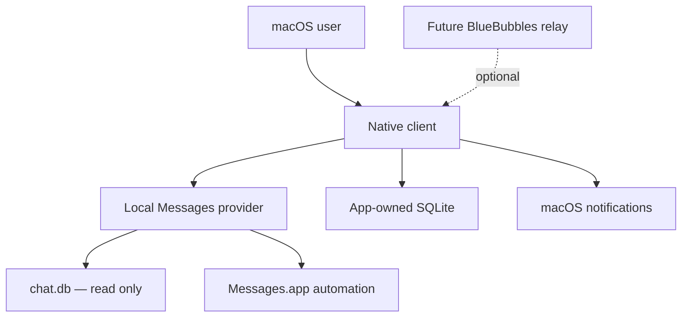
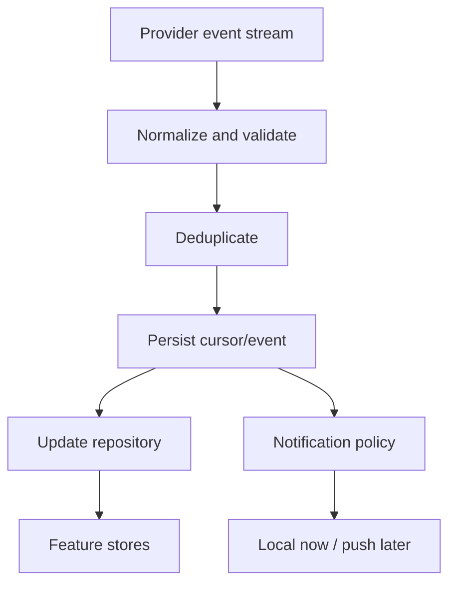
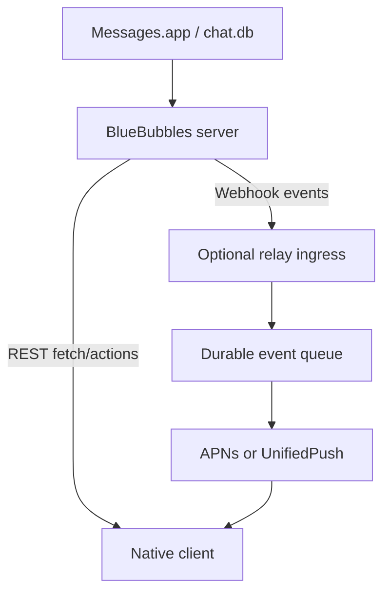

# Architecture: Native macOS iMessage Client

## 1. Architecture summary

Build a native Swift application with SwiftUI as the main presentation framework and AppKit where native desktop behavior or large-list performance requires it. The application reads Messages data through an isolated provider and sends through provider-owned macOS automation. Trill's own code never writes to Apple's Messages database directly; any write-backed capability is delegated to a well-maintained, vetted third-party library rather than hand-rolled SQL.

The architecture separates five concerns:

1. Presentation and macOS interaction.
2. Product-domain state and use cases.
3. Provider-neutral repositories and event streams.
4. Provider adapters for local Messages access and future BlueBubbles access.
5. App-owned persistence, notification policy and delivery.

The initial app is a single local process. No relay, daemon or cloud service is required.

## 2. System context



### Trust boundaries

- `chat.db` and Messages attachments are private system/user data outside the app's ownership.
- The app-owned database contains organization and operational state.
- Messages automation crosses a macOS TCC permission boundary.
- Contacts access is a separate TCC boundary.
- A future relay introduces a network and credential boundary and therefore remains opt-in.

## 3. Technology decisions

### 3.1 Language and UI

- Swift 6 language mode where dependencies permit it.
- Swift concurrency with strict concurrency checking enabled incrementally.
- SwiftUI for navigation, settings, onboarding, inspectors and ordinary views.
- AppKit wrappers for any component that cannot meet performance or interaction requirements in pure SwiftUI, likely the message timeline, advanced text editor or window/tab handling.
- Minimum deployment target: macOS 14. Re-evaluate only if a dependency forces a newer target.

### 3.2 Packaging and distribution

- Standard Xcode macOS application project committed to source control.
- Hardened Runtime enabled.
- Developer ID signing and notarization for distribution.
- Direct distribution is the baseline. Do not assume Mac App Store sandbox compatibility.
- App Sandbox is expected to be disabled because the product requires read access to a protected database outside its container. Confirm during the feasibility spike.

### 3.3 Dependencies

Keep the dependency set deliberately small:

- The shipping live provider has **no third-party read/send dependency**: it is our own `ChatDatabaseReader` (direct `SQLITE_OPEN_READONLY` SQL over `chat.db`) plus `MessagesSender` (AppleScript via `osascript`). See §6.
- `beeper/platform-imessage` is pinned and compiled for DTO-contract mapping tests. Its `PlatformAPI` is instantiated **only** through `PlatformWriteBackend` behind the composite write overlay (§6.3), and **only** when the `platformWritesEnabled` flag is set on a vetted signed host — for write-backed advanced actions (currently tapbacks). It is never on the read path, and by default the flag is off and it is never constructed.
- A SQLite layer for the app-owned store. The app uses a small direct SQLite wrapper (`AppDatabase`); GRDB or SQLite.swift remain options if richer needs appear.
- No networking framework beyond `URLSession` until the remote relay phase.
- No analytics SDK.

Every dependency must be pinned to a reviewed release or exact revision. Record license, update strategy and removal plan.

## 4. Layered module design

Recommended source layout:

```text
Trill/
  App/
    TrillApp.swift
    AppEnvironment.swift
    AppCommands.swift
    WindowCoordinator.swift
  Domain/
    Models/
    Capabilities/
    UseCases/
    Errors/
  Repositories/
    MessagesRepository.swift
    ContactsRepository.swift
    NotificationRepository.swift
  Providers/
    MessagesProvider.swift
    LiveIMessage/            # shipping provider: read-only chat.db SQL + AppleScript send
    FixtureProvider/
    PlatformIMessageProvider/ # gated: compiled for DTO mapping, PlatformAPI not instantiated
    BlueBubblesProvider/     # future placeholder only
  Persistence/
    AppDatabase.swift
    Migrations/
    Records/
  Features/
    Onboarding/
    Inbox/
    Conversation/
    Composer/
    Search/
    Settings/
    Diagnostics/
  Notifications/
    NotificationEvent.swift
    NotificationPolicyEngine.swift
    NotificationScheduler.swift
    LocalNotificationDelivery.swift
  Platform/
    Permissions/
    Keychain/
    Logging/
    QuickLook/
  Tests/
    Fixtures/
```

Do not expose third-party library models above `Providers/`.

## 5. Core provider contract

The exact Swift API may evolve during the spike, but it should express these capabilities:

```swift
protocol MessagesProvider: Sendable {
    var id: ProviderID { get }

    func health() async -> ProviderHealth
    func capabilities() async -> ProviderCapabilities

    func conversations(page: ConversationPageRequest) async throws -> ConversationPage
    func messages(in conversation: ConversationID,
                  page: MessagePageRequest) async throws -> MessagePage
    func search(_ query: MessageSearchQuery) async throws -> MessageSearchPage

    func events(after cursor: EventCursor?) -> AsyncThrowingStream<ProviderEvent, Error>

    func send(_ request: SendRequest) async throws -> SendOutcome
    func react(_ request: ReactionRequest) async throws -> ReactionOutcome
}
```

Optional actions are represented through `ProviderCapabilities`; callers must not infer support from provider type.

Example capabilities:

- Read conversations
- Read messages
- Search
- Watch live events
- Send text
- Send attachments
- Send standard reactions
- Start direct chat
- Mark read
- Create inline reply
- Edit or unsend
- Typing indicators
- Group management

Unsupported actions should not throw generic failures after the UI offers them. The UI must check capabilities and either hide the action or explain why it is unavailable.

## 6. Provider strategy

### 6.1 Shipping provider: native `LiveIMessage`

The live provider is our own code, with no third-party read/send library (see [ADR 0002](architecture-decisions/0002-live-imessage-provider.md)). It has three parts:

- **Reads — `ChatDatabaseReader`.** Opens `chat.db` with `SQLITE_OPEN_READONLY` per call and issues plain SELECTs (chats, messages, handles, reactions, attachments, search, all-chats attachment/link scans for the Universal Library). Message bodies with NULL `text` are decoded from the typedstream `attributedBody` blob (`TypedstreamText`), validated against real rows before adoption.
- **Sends — `MessagesSender`.** Shells to `osascript`, targeting `chat id <chat.guid>` in Messages.app with a participant fallback for 1:1 chats. Messages.app owns persistence; Trill never writes `chat.db`. Message content is passed as an AppleScript argument, never string-interpolated into the script.
- **Live updates.** A `chat.db-wal` event source (with a polling fallback) emits `messageAdded`/`conversationUpdated` events and drives in-place edits, tapbacks and receipt changes on the open thread.
- **Names — `ContactsNameResolver`.** Maps handles to names/photos via the Contacts framework when granted (suffix-10 phone matching, lowercased emails); falls back to reading the local AddressBook store directly under Full Disk Access when Contacts is denied.

Advantages: same-process native Swift, no helper lifecycle, permissions bound to the app bundle, easy cancellation. Cost: the send path is AppleScript-only, so it structurally cannot create tapbacks, threaded replies, edits/unsends, typing indicators or mark-as-read — those need either a `chat.db` write or private automation, which is why they are display-only today (§6.3 covers the future unlock).

### 6.2 Historical candidates (not used)

Earlier planning evaluated `openclaw/imsg` (`IMsgCore` direct integration, or a bundled `imsg rpc` helper process). The product direction moved to Beeper's `platform-imessage` and then to the native path above; neither `imsg` route is a dependency. They are noted only so they are not re-proposed as the primary path.

### 6.3 Advanced provider candidate: `platform-imessage`

Beeper's MIT-licensed `platform-imessage` is an embeddable Swift package (already pinned and compiling) that wraps a full `PlatformAPI`: paged threads and messages, search, a live event stream, sending, and — through its automation/Accessibility layer with SIP enabled — the write-backed actions our native read-only path structurally can't do. Concretely, it can unlock **sending tapbacks/reactions, editing and unsending, marking conversations read, threaded replies, and typing indicators** — the exact gaps ADR 0002 lists. It also keeps its own `chat.db` schema handling current (its only direct write is a couple of performance indexes on `date_read`/`date_edited`), which under the [relaxed no-write policy](../security.md) is acceptable precisely because it's a vetted, well-maintained library rather than hand-rolled SQL of ours.

It is a real candidate, not a gated no-go — but it is not free. Its advanced actions ride a broad Accessibility + Apple Events permission and are more sensitive to Messages UI changes than plain DB reads, so each capability must be independently probed and user-enabled, and the whole library must clear a signed-host vetting/validation pass (see [ADR 0001](architecture-decisions/0001-messages-provider.md)) before we trust it live. The sensible sequencing is to keep shipping the native read-only provider as the stable baseline and layer `platform-imessage` in only for the richer write-backed actions once that vetting is done.

### 6.4 Future provider: BlueBubbles

BlueBubbles is not an MVP dependency. Preserve it as a future provider and relay because it offers:

- A self-hosted Mac server.
- REST endpoints.
- Webhooks for new messages, message updates, errors, group changes, read-state changes, typing, and server changes.
- Existing push workflows, including webhook-compatible UnifiedPush.

The app should consume BlueBubbles through `BlueBubblesProvider`, mapping REST resources and webhook events into the same domain models and `ProviderEvent` stream used by local providers.

## 7. Domain model

Use stable provider-qualified identifiers. Numeric `chat.db` row IDs are useful cursors but are not globally stable identity.

### Core identifiers

```swift
struct ProviderID: Hashable, Codable, Sendable {
    let rawValue: String
}

struct ConversationID: Hashable, Codable, Sendable {
    let provider: ProviderID
    let externalGUID: String
}

struct MessageID: Hashable, Codable, Sendable {
    let provider: ProviderID
    let externalGUID: String
}
```

### Conversation

Important fields:

- Provider-qualified ID.
- Display name and optional system name.
- Participants as normalized handles.
- Direct/group classification.
- Service: iMessage, SMS or unknown.
- Last activity date.
- Last message preview.
- Provider unread state if available.
- Capability/routing hints.

### Message

Important fields:

- Provider-qualified message ID and conversation ID.
- Provider sequence/cursor metadata.
- Sender handle and display name.
- Outgoing flag.
- Text as plain/attributed components.
- Creation, sent and delivery timestamps where available.
- Attachments.
- Reactions.
- Reply parent ID and thread origin ID.
- Transport/service.
- Delivery state and failure metadata.
- Raw unsupported payload metadata only in a debug-safe, non-persisted representation.

### Attachment

- Stable provider identifier when available.
- Display filename, MIME type, UTI and byte count.
- Local URL only while authorized and available.
- Missing/download-required state.
- Thumbnail state separated from original state.
- Security-scoped or provider fetch mechanism for future remote sources.

### Send outcome

Model uncertainty explicitly:

```swift
enum SendOutcome: Sendable {
    case accepted(operationID: UUID)
    case confirmed(operationID: UUID, messageID: MessageID)
    case rejected(operationID: UUID, reason: UserFacingSendError)
    case unknown(operationID: UUID, diagnosticCode: String)
}
```

An unknown outcome must not trigger an automatic resend. Reconcile it against newly observed outgoing messages.

## 8. Data access and repository behavior

### 8.1 Apple's Messages store

- Open with SQLite read-only flags.
- Never execute schema migrations, pragmas that write, vacuum, repair or row updates.
- Account for `chat.db-wal` and `chat.db-shm` behavior through the provider.
- Run all queries off the main actor.
- Use bounded pages and cancellation.
- Treat schema mismatch as a provider health error, not an invitation to guess columns.

### 8.2 App-owned store

Store under the app's Application Support directory.

Initial tables:

- `schema_migrations`
- `conversation_preferences`
- `conversation_tags`
- `tags`
- `drafts`
- `pinned_conversations`
- `snoozes`
- `notification_rules`
- `notification_events`
- `provider_cursors`
- `send_operations`
- `restored_tabs`

The MVP should not duplicate the entire Messages history unless profiling proves a cache is required. Keep Apple/provider data as source of truth and store only app-owned state plus bounded operational records.

### 8.3 Repository actor

`MessagesRepository` should be an actor responsible for:

- Provider lifecycle.
- Mapping and validation.
- Merging pages and live events.
- Deduplication by provider-qualified message GUID.
- Durable cursor commits after successful event processing.
- Bounded reconciliation on launch, wake and provider reconnect.
- Publishing immutable snapshots or AsyncStreams to feature stores.

Avoid a single global observable object containing every message. Feature stores own presentation state; the repository owns canonical operational state.

## 9. Live-event pipeline



Processing rules:

1. Normalize provider data before any UI or notification consumer sees it.
2. Reject malformed events without advancing past unrecoverable gaps silently.
3. Deduplicate by event identity and message identity.
4. Persist the event/cursor transactionally with notification enqueue state.
5. Publish repository changes.
6. Evaluate notification policy.
7. Mark delivery attempts and outcomes.

On restart or wake, fetch a bounded recent window from the source and reconcile against stored message/event IDs before resuming the live cursor.

## 10. Notification architecture

Notifications are a product subsystem, not a side effect in the watcher.

### 10.1 Components

- `NotificationEvent`: provider-neutral incoming/update event.
- `NotificationContext`: focus state, active conversation, sender/chat metadata and current time zone.
- `NotificationPolicyEngine`: pure rules evaluation.
- `NotificationQueue`: durable queued, deferred and digest events.
- `NotificationScheduler`: burst coalescing, quiet hours and digest timing.
- `NotificationRenderer`: produces privacy-respecting title/body/actions.
- `NotificationDelivery`: protocol implemented initially by `LocalNotificationDelivery`.

### 10.2 Policy precedence

Suggested order, highest specificity first:

1. Temporary snooze.
2. Per-conversation override.
3. Tag/folder rule.
4. Direct-message versus group rule.
5. Global quiet-hours rule.
6. Global default.

Each evaluation should return a reason code for diagnostics.

### 10.3 Delivery modes

- Immediate.
- Coalesced burst after a short idle window.
- Next scheduled digest.
- Badge/unread only.
- Suppressed.

### 10.4 Local delivery

Use `UNUserNotificationCenter`. Notification identifiers should be deterministic per event or coalesced batch to prevent duplicates. Actions can include reply later, mute, snooze and open conversation; direct reply from the notification is deferred until send reliability is established.

### 10.5 Future remote push

Keep push behind a `NotificationDelivery` adapter. The default secure shape is a wake/pointer notification:

```json
{
  "event_id": "opaque-id",
  "provider_id": "relay-instance-id",
  "conversation_hint": "opaque-conversation-id",
  "cursor": "opaque-cursor"
}
```

The receiving client authenticates to the relay and fetches the normalized event. Message text, contact handles and attachment paths should not pass through third-party push infrastructure by default.

Digest generation occurs after authenticated fetch on the receiving device where possible. If server-side digests are later required, they need a separate data-retention and encryption decision.

## 11. Future BlueBubbles relay design

### 11.1 Why preserve it

BlueBubbles solves a different problem from the local library: it exposes the Mac's Messages access through REST, webhooks and push-friendly integrations. This becomes relevant when:

- The client runs on a different device.
- The local Mac app is not continuously active.
- A relay needs to fan out events to multiple clients.
- Custom remote pushes or digests are desired.

### 11.2 Proposed topology



For a Mac-only client on the same host, this topology is unnecessary. It is a Phase 4 option.

### 11.3 Adapter responsibilities

`BlueBubblesProvider` should:

- Authenticate through a Keychain-stored server credential.
- Redact authentication query parameters from all logs.
- Require HTTPS except for explicit loopback development.
- Prefer private-network connectivity such as a VPN/Tailscale-style network over public exposure.
- Page and map REST responses into domain models.
- Convert webhook events into `ProviderEvent` values.
- Maintain a remote cursor and reconcile missed events through REST.
- Download attachments to an app-controlled cache with size/type limits.
- Expose server and feature capability health.

BlueBubbles documentation currently describes a server password supplied as a `guid`, `password` or `token` query parameter. Treat URLs containing that value as secrets and never persist them in logs, crash reports or analytics.

### 11.4 Push choices

- **APNs:** best for an Apple-platform client distributed with the appropriate signing and server setup.
- **UnifiedPush:** self-hostable and already supported through BlueBubbles webhook workflows; useful if non-Apple clients are later considered.
- **Firebase:** BlueBubbles supports Firebase-oriented setups, but it should not become a required dependency for this product.

The provider event model and notification delivery interface should allow APNs and UnifiedPush to coexist.

### 11.5 Threat model requirements before implementation

- Enumerate assets: Apple account access, message content, attachments, contacts, server password, device tokens and notification metadata.
- Authenticate clients and rotate/revoke credentials.
- Protect replay-sensitive webhooks with signatures or a private authenticated ingress; do not trust source IP alone.
- Enforce TLS certificate validation.
- Rate-limit authentication and attachment endpoints.
- Avoid exposing BlueBubbles directly to the public internet when a private network is viable.
- Define retention and deletion for relay queues.
- Make compromised-device revocation possible.
- Test push payload redaction.

## 12. Permissions and entitlement model

### Required baseline permissions

- Full Disk Access / Messages Data access to read the protected database and attachments.
- Apple Events Automation permission to control Messages.app for sending.
- Contacts permission only for local name and avatar resolution.
- User Notifications permission for local notifications.

### Optional future permission

- Accessibility for an explicitly enabled advanced provider. It is not required for baseline operation.

### Entitlements and metadata to evaluate

- `com.apple.security.automation.apple-events` for hardened-runtime Apple Events.
- `NSAppleEventsUsageDescription` with clear user-facing purpose text.
- `NSContactsUsageDescription`.
- Notification permission explanation in onboarding.
- App Sandbox state and any related signing consequences.

Do not request all permissions at launch. Request them in context and surface a persistent health screen.

## 13. Security requirements

- SIP stays enabled; code must not instruct the user to disable it.
- Open Apple's database read-only.
- Store BlueBubbles credentials and future tokens in Keychain.
- Use `OSLog` privacy annotations and default-private fields.
- Never log message bodies, handles, attachment paths, access tokens or database rows.
- Do not execute arbitrary shell commands or AppleScripts built from unescaped message content.
- Stage outbound files only in an app-controlled temporary directory with cleanup.
- Validate attachment size, type and existence before preview or upload.
- Apply output encoding and parameterized database queries.
- Ship no remote listening port in the local MVP.
- Make diagnostics export opt-in and redact content.

## 14. Concurrency and state management

- UI state is `@MainActor`.
- Provider and repository operations run in actors.
- Database connections are confined to their owning actor/queue.
- `AsyncSequence`/`AsyncThrowingStream` carries live events.
- Long queries support task cancellation.
- Use structured tasks tied to feature/window lifetime; avoid detached tasks except for carefully owned services.
- Backpressure the event stream and bound in-memory queues.
- Persist a cursor only after durable processing.

## 15. UI architecture

### Feature stores

Use small `@Observable @MainActor` feature models:

- `OnboardingModel`
- `InboxModel`
- `ConversationModel`
- `ComposerModel`
- `SearchModel`
- `SettingsModel`
- `DiagnosticsModel`

Inject use cases/repositories through `AppEnvironment`; do not use uncontrolled singletons.

### Timeline rendering

Start with a paged `LazyVStack` inside `ScrollView` only if profiling meets the performance target. Preserve an escape hatch to an `NSCollectionView` implementation for:

- Stable cell reuse.
- Scroll anchoring during prepend.
- Very large histories.
- Rich selection and context-menu behavior.

Do not pre-render every message or decode full-resolution images on the main thread.

### Composer

Use a native text view wrapper if SwiftUI's editor cannot provide:

- Reliable pasteboard attachment handling.
- Keyboard command control.
- Undo/redo integration.
- Drag-and-drop insertion.
- Dynamic but bounded height.

## 16. Error and health model

Represent actionable health dimensions separately:

```swift
struct ProviderHealth: Sendable {
    var messagesDatabase: HealthState
    var liveEvents: HealthState
    var sending: HealthState
    var contacts: HealthState
    var notifications: HealthState
    var remoteRelay: HealthState?
}
```

Do not collapse all failures into “Connection error.” Suggested user-facing states:

- Messages database permission missing.
- Messages.app not signed in.
- Automation permission denied.
- Contacts permission denied.
- Provider schema unsupported.
- Live watcher reconnecting.
- Send rejected.
- Send outcome unknown; check conversation before retrying.
- Attachment unavailable.
- Remote relay unreachable or authentication failed.

## 17. Testing strategy

### Unit tests

- Provider-to-domain mapping.
- Notification policy precedence.
- Digest grouping and privacy rendering.
- Event deduplication.
- Cursor reconciliation.
- Send-outcome state machine.
- Local database migrations.
- Search query validation.

### Fixture tests

- Sanitized/copy-generated SQLite fixtures representing supported schema variants.
- Direct chat, group chat, SMS, attachments, reactions, replies and missing files.
- Large synthetic conversation for performance tests.
- Never commit real personal message databases or attachment paths.

### Provider conformance tests

Every provider must pass the same behavioral suite:

- Stable identity.
- Deterministic pagination.
- Event ordering and deduplication.
- Capability accuracy.
- Cancellation.
- Permission/error mapping.
- Send outcome semantics.

### Integration tests

- App-owned database transactions and recovery.
- Provider-to-domain mapping against `platform-imessage` DTO fixtures.
- Sleep/wake and watcher restart simulation.
- Notification scheduling using injected clock and delivery spy.
- BlueBubbles REST/webhook mapping in Phase 4 using a local mock server.

### UI tests

- First-launch permission states.
- Keyboard navigation.
- Open conversation and paginate.
- Draft restoration.
- Search and jump to message.
- Accessibility labels and focus order.

### Manual release tests

Use a dedicated test conversation/account where practical. Validate sending manually because it has external side effects. The automated suite must never send to real contacts by default.

## 18. Observability

- Use subsystem/category-based `OSLog`.
- Record timing and counts, not message content.
- Useful metrics: query duration, page size, event lag, reconciliation count, watcher restarts, notification decision reason and send outcome class.
- Provide an in-app diagnostics view with provider version, database reachability, permission state, last event time and last cursor.
- Diagnostics export must redact stable identifiers with per-export random tokens.

## 19. Build and delivery milestones

### Milestone A: repository and fixture reader — shipped

- Native app builds and tests.
- Provider protocol and domain types.
- Fixture provider.
- `platform-imessage` pinned and compiled behind a gated adapter for DTO-contract mapping.
- Conversation and timeline UI against fixtures.

### Milestone B: live local access — shipped

- Permission health checks.
- Read-only live conversations and messages via native `ChatDatabaseReader`.
- WAL-driven live watch and reconciliation.
- Contacts integration.

### Milestone C: sending — shipped

- Text and attachment composer.
- AppleScript send via `MessagesSender` and the Automation permission flow.
- Send operation tracking and unknown-outcome reconciliation; undo-send window.

### Milestone D: useful daily client — shipped

- Search, pins, drafts and local notifications (with inline reply).
- Performance and recovery hardening; accessibility audit ongoing.

### Milestone E: organization and digests — in progress

- Shipped: tags/folders, snooze, archive, mute, VIP, service filters, conversation tabs.
- Remaining: notification rules, quiet hours, burst batching and scheduled digests.

### Milestone F: optional relay — future

- BlueBubbles provider spike, network threat model and push adapter.

## 20. Architectural acceptance criteria

- No feature outside `Providers/` imports `platform-imessage`/`PlatformSDK` DTOs or BlueBubbles DTOs.
- Trill's own code opens no write-capable connection to Apple's Messages database; any such write path is delegated to a vetted third-party library, never hand-rolled.
- Fixture provider can run the primary UI without private user data.
- Provider capabilities control action availability.
- Message/event identity is provider-qualified and deduplicated.
- Notification policy is independently testable without macOS notification delivery.
- Remote push can be added as a delivery adapter without changing conversation views.
- BlueBubbles can be added as a provider without changing domain models.
- Permission and provider failures map to actionable health states.
- Sending exposes unknown outcomes and never blindly retries.

## 21. References and current assumptions

- The shipping live provider is native Trill code (`ChatDatabaseReader` + `MessagesSender`): direct read-only `chat.db` access, WAL-driven watching with a polling fallback, and AppleScript sending. It depends on no third-party messaging library.
- [`beeper/platform-imessage`](https://github.com/beeper/platform-imessage) documents an embeddable Swift package with automation/Accessibility-based advanced actions while SIP remains enabled; pinned and compiled but not instantiated (§6.3).
- [`openclaw/imsg`](https://github.com/openclaw/imsg) was an earlier evaluated candidate (`IMsgCore` library / `imsg rpc` helper); it is not a dependency (§6.2).
- [BlueBubbles REST API & Webhooks](https://docs.bluebubbles.app/server/developer-guides/rest-api-and-webhooks) documents REST authentication and webhook categories.
- [BlueBubbles UnifiedPush](https://docs.bluebubbles.app/client/usage-guides/using-unified-push-for-notifications) demonstrates webhook-based delivery through a UnifiedPush distributor.
- [Apple's Apple Events entitlement documentation](https://developer.apple.com/documentation/bundleresources/entitlements/com.apple.security.automation.apple-events) is the baseline reference for hardened-runtime automation entitlement configuration.

All dependency behavior is subject to change. The implementation spike must verify current tagged releases and macOS behavior rather than treating this document as API-level documentation.

## 22. Roadmap

This is the forward sequencing for the [PRD](PRD.md)'s durable requirements. Current shipped state lives in the [README](README.md); the running idea pool with per-feature status is [docs/ideas.md](docs/ideas.md).

### Shipped foundation

Native live provider (read-only `chat.db` + AppleScript send), WAL-driven live updates and reconciliation, contacts, global + in-thread search with operators, command palette, pins/drafts/read marks, local notifications with inline reply, and the first wave of power-user organization (folders/tags, snooze, archive, mute, VIP, service filters, Universal Library, conversation stats, needs-reply triage).

### Next — power-user organization (completing PRD §7.2/§7.5)

- Multiple conversation windows and window-state restoration (conversation tabs shipped).
- Saved searches and richer search-filter UI.
- Attachment/library refinements.
- Accessibility audit (VoiceOver, Dynamic Type, high-contrast theme).

### Then — notification intelligence (PRD §7.6)

- Durable notification event inbox.
- Per-person/group rules, quiet hours and burst coalescing.
- Scheduled and rule-based digests with custom presentation.
- Optional on-device summarization only after a separate privacy/design review.

### In progress — write-backed advanced actions

The vetted `platform-imessage` layer (§6.3) is being adopted as a **composite write overlay**: `CompositeMessagesProvider` keeps `LiveIMessageProvider` as the read + text-send baseline and delegates only write-backed actions to `PlatformWriteBackend` (which drives `PlatformAPI`). The first action, **sending tapbacks**, is implemented behind the hidden `platformWritesEnabled` flag and an Accessibility health gate (`CapabilityGate.canReact`); it stays off until the signed-host vetting/validation pass in [ADR 0001](architecture-decisions/0001-messages-provider.md) is completed on a Developer-ID-signed build. Reply sending, edits/unsends and mark-as-read follow the same pattern. Each capability is independently probed and user-enabled; the native read-only provider remains the stable baseline.

### Optional — remote relay and push (PRD §7.6 remote push)

BlueBubbles REST/webhook provider (§6.4, §11), Keychain-stored credentials, APNs and/or UnifiedPush delivery adapter, remote event fetch with cursor recovery, and an explicit network threat model. Only pursued if a concrete remote-client need justifies it.
